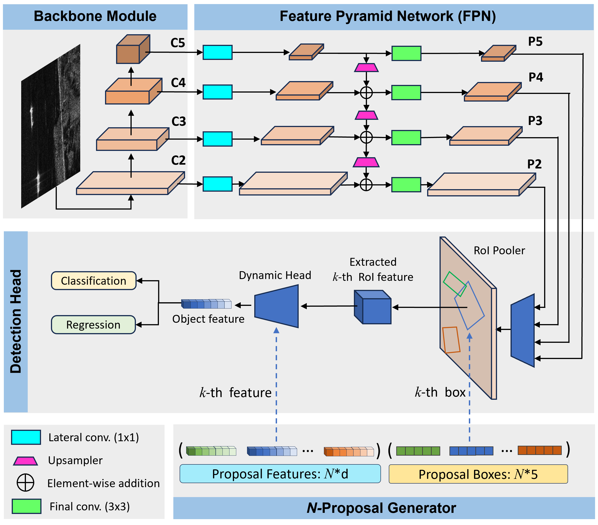
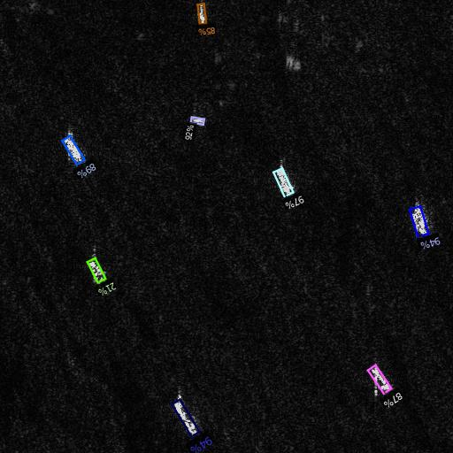

## Sparse R-CNN OBB: Ship Target Detection in SAR Images Based on Oriented Sparse Learnable Proposals
[](https://www.gnu.org/licenses/gpl-3.0)  [](https://zenodo.org/records/15519225) [](https://doi.org/10.5281/zenodo.15514670) [](https://arxiv.org/abs/2409.07973) [](https://doi.org/<your_DOI_here>)

<p align="center">
  
</p>

## Publication link: [ICIP 2025](https://arxiv.org/abs/2409.07973)


## Built Upon

This codebase is built on top of:

- [Detectron2](https://github.com/facebookresearch/detectron2)
- [DETR](https://github.com/facebookresearch/detr)
- [Sparse R-CNN](https://github.com/PeizeSun/SparseR-CNN) — which serves as our baseline

We have modified and extended Sparse R-CNN to develop **Sparse R-CNN OBB**, incorporating additional functionality and structural improvements described in our work.


## Installation
#### Requirements
- Linux or macOS with Python ≥ 3.6.
- You’ll need PyTorch ≥ 1.5 along with a [torchvision](https://github.com/pytorch/vision/) version that matches your PyTorch installation.  
For best compatibility, install both from [pytorch.org](https://pytorch.org).
- OpenCV is optional and needed by demo and visualization.

#### Steps
1. Download \
   Download codes from this repo and pretrained weights here: [zenodo.org/records/15514670 ](https://zenodo.org/records/15514670). \
   These pretrained weights were obtained by training on [RSDD-SAR](https://github.com/makabakasu/RSDD-SAR-OPEN) dataset.
   
1. Create your virtual environment \
   Navigate to codes directory and create virtual environment.
```
python3 -m venv venv
```
  Then, active the virtual environment:

```
source venv/bin/activate
```
2. Install required libraries
```
pip install opencv-python scipy pillow matplotlib pycocotools
```
3. Install Detectron 2
```
pip install -e .
```

4. Demo
```    
python demo/demo.py\
    --config-file projects/Sparse_RCNN_OBB/configs/sparse_rcnn_obb.res50.300pro.RSDD.yaml \
    --input RSDD_test_sample_34_24_16.jpg --output demo_output.jpg --confidence-threshold 0.2 \
    --opts MODEL.WEIGHTS saved_models/R-50_300pro_RSDD.pth
```
If everything is correct, you should have `demo_output.jpg` like below:



**Note:** `RSDD_test_sample_34_24_16.jpg` is an example image from the RSDD-SAR test set and is licensed under the [Apache 2.0 License](https://www.apache.org/licenses/LICENSE-2.0).

## Training with Custom Dataset (Including RSDD-SAR)
See the [guide](./Training.md) for custom dataset training.

## License

Sparse R-CNN-OBB is released under **GNU General Public License v3.0 (GPL-3.0)**.


## Citation
Cite us using the following BibTeX entries:
```BibTeX

@misc{kamirul2024rsparse,
      title={Sparse R-CNN OBB: Ship Target Detection in SAR Images Based on Oriented Sparse Proposals}, 
      author={Kamirul Kamirul and Odysseas Pappas and Alin Achim},
      year={2024},
      eprint={2409.07973},
      archivePrefix={arXiv},
      primaryClass={cs.CV},
      url={https://arxiv.org/abs/2409.07973}, 
}
```
## Related Works
**[[R-Sparse R-CNN](https://github.com/ka-mirul/R-Sparse-R-CNN)]** – We’ve released an improved version of **R-Sparse R-CNN OBB**, called **R-Sparse R-CNN**.  
It introduces novel Background-Aware Sparse Proposals (BAP) to enhance performance in inshore ship detection.  
Read more in our [arXiv paper](https://www.arxiv.org/abs/2504.18959).


